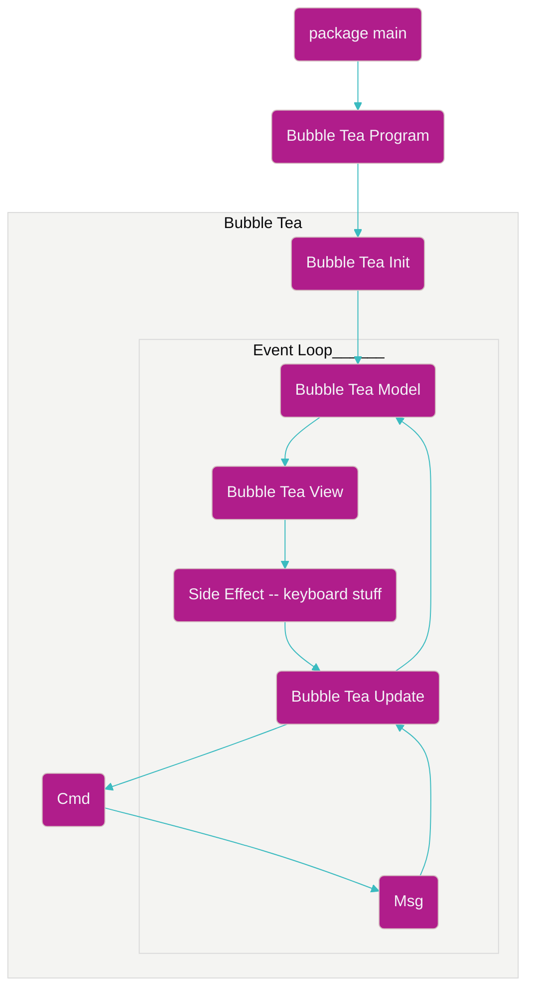

<InlineImage
  containerClassName="mx-0 lg:mx-0"
  imgDivClassName="aspect-w-12 aspect-h-8"
  src="https://res.cloudinary.com/dinypqsgl/image/upload/v1710111485/blog/13-chatgpt-tui/chatgpt-tui_ffsglh.webp"
  alt="A bubbletea sitting on top of a laptop"
/>

You know the drill; start with why! If you don't know of Simon Sinek's TED talk,
I highly recommend it. It's a great talk that has helped me in many aspects of
my life. So, let's start with why I decided to make a terminal user interface
(TUI) with Go.

The primary reason I made this TUI was because it aligned with my goals for the
year. If you read [my previous blog post](./12-go-htmx-and-lit/), you know that
I'm devoting 2024 to learning Go and trying my best to channel my inner Gopher.
Moreover, I wanted to create a project that would be not only helpful to me but
also to my colleagues. Since I'm an avid `neovim` user, I'm fortunate to be able
to use &nbsp;<TextLink href="https://github.com/jackMort/ChatGPT.nvim">
ChatGPT.nvim</TextLink> while I'm working on features. However, my colleagues
who use `VSCode` don't have the same luxury (yeah yeah, I know they have
copilot, but the neovim plugin just hits different). Beyond those reasons, the
final (some would say superficial) reason is that I wanted to make a TUI because
I thought it would be fun. because AI is the latest buzzword and I wanted to be
part of the hype train 🚄.

## What did I make?

I made a TUI that allows you to interact with OpenAI's ChatGPT model. The TUI is
written in Go and is therefore `blazingly fast` (cringed as I typed that 😅).
The TUI is a simple interface (because, it's Go, we gotta embrace simplicity)
that allows you to interact with the your chosen model (it defaults to
`chatgpt-3.5-turbo`).

<InlineImage
  lazyLoadImage
  openInNewTab
  containerClassName="mx-0 lg:mx-0"
  className="transition-duration-500 transition-transform hover:scale-[1.15]"
  imgDivClassName="aspect-w-12 aspect-h-7"
  src="https://res.cloudinary.com/dinypqsgl/image/upload/v1710113600/blog/13-chatgpt-tui/tui-shot_pt9uab.png"
  alt="A demo shot of the tui in action"
/>

If you want to try it out yourself, you can find the source code on
[GitHub](https://github.com/tearingItUp786/chatgpt-tui)! Now, if you're
wondering what did I use to make this work of art (awh shucks, thanks friend),
fret not friend, I'll tell you (I mean, you can just check out the repo, but
I'll tell you here as well 😆).

- [bubbletea](https://github.com/charmbracelet/bubbletea): A Go framework for
  terminal user interfaces. It's a great framework that makes it easy to create
  TUIs in Go.
- [openai](https://platform.openai.com/docs/api-reference): OpenAI's REST Api
- [sqlite](https://www.sqlite.org/): A C library that provides a lightweight
  disk-based database that doesn't require a separate server process (perfect
  for terminal apps, in my opinion).
- [lipgloss](https://github.com/charmbracelet/lipgloss): Style definitions for
  nice terminal layouts!
- [bubbles](https://github.com/charmbracelet/bubbles): Some general use
  components for Bubble Tea apps!

## The fun parts

Before I jump into the things that I struggled with (and ultimately learned a
lot about) while developing this application, I want to cover the things that
got me going as I was chugging along with this tui.

### The Elm Architecture

First and foremost, I was thrilled to learn more
about&nbsp;<TextLink href="https://guide.elm-lang.org/architecture/">The Elm
Architecture</TextLink>. For those of you who aren't familiar, Elm is a
functional programming language that compiles to JavaScript -- wild right. The
Elm Architecture is a pattern that is used to build web applications in Elm
(duh). In short, there are three parts to the Elm Architecture: `Model`, `View`,
and `Update`. The `Model` is the state of the application, the `View` is the way
to turn your state into the UI, and the `Update` is way to update your state
based on messages. You can check out this simple example using the Elm
Architecture in Go
on&nbsp;<TextLink href="https://github.com/tearingItUp786/chatgpt-tui/blob/main/cmd/main.go">Github</TextLink>
;it writes what the user just typed into a `debug.log` file.

Coming from `React`, it was tough to wrap my head around this architecture at
first, but as I worked my way through this project, I started to see the beauty.
Simple, yet elegant. Huge shout out to the one homie on youtube that made a
video on the Elm Architecture in Go; you can watch it below.

https://www.youtube.com/watch?v=ERaZi0YvBRs

It wasn't enough to consume the video that I watched above; I had to try and
reason about what was going on in the code. So, before I even wrote any code, I
created the below mermaid diagram to help me understand how exactly I would go
about creating the TUI. Now I want to be clear, I iterated on the below diagram
quite a bit and it's the _basic_ understanding that I arrived at after watching
the video and playing around with some bubbletea examples. Don't `@` me if it's
not perfect 😅.



This type of architecture was fun to wrestle with and I'm glad I did (I freaking
love diagramming)! One of the most fun things for me was trying to figure out
how to handle concurrency in Go. I'm coming from Browser and Node land, so I'm
used to `async` and `await`, and event loop with several types of queues and a
call stack. Go's concurrency model is different, but it's not too difficult to
understand; its simpler than other models I have experience with, like in
traditional C programs.

My understanding of concurrency in Go can be summarized as follows:

<BlockQuote>
  Don't communicate by sharing memory; share memory by communicating
</BlockQuote>

Rather than trying to use `locks` and `mutexes` to control access to shared
memory, Go encourages you to use channels to communicate between goroutines. In
fact, `bubbletea` uses its own scheduler to handle goroutines that are
dispatched by `Commands`; it's kind of an anti-pattern to use go routines in a
`bubbletea` program. If you want to learn the basic rules of thumbs when it
comes to `Commands` in BubbleTea, check out
this&nbsp;<TextLink href="https://charm.sh/blog/commands-in-bubbletea/">blog
post</TextLink>.

So yeah, I didn't _directly_ write any goroutines in my program, but I did have
to reason about how to handle concurrency in my program, specifically when I was
consuming the streamed response from OpenAI's API. I had to figure out how to
handle the stream of responses from OpenAI's API and update the state of my
application accordingly. I ended up assigning my own ID's to each message that I
received from the stream and then used those ID's to sort the messages that were
coming in.

```go
func (m *Model) appendAndOrderProcessResults(msg ProcessResult) {
	// log.Println("Appending and ordering process results", msg)
	m.ArrayOfProcessResult = append(m.ArrayOfProcessResult, msg)
	m.CurrentAnswer = ""

	// we need to sort on ID here because go routines are done in different threads
	// and the order in which our channel receives messages is not guaranteed.
	// TODO: look into a better way to insert (can I Insert in order)
	sort.SliceStable(m.ArrayOfProcessResult, func(i, j int) bool {
		return m.ArrayOfProcessResult[i].ID < m.ArrayOfProcessResult[j].ID
	})
}
```

If you've got a better solution in your brain, hit me up; I'd love to hear it!

### Publishing something to the world (that isn't a TODO app)

Let's be honest (well I'll be honest), the first app most people make when they
are learning a new language or framework is a TODO app. I'm TODO'd out guys and
unlike Ryan Florence, I don't think I have it in me right now to make Trellix
😆. Plus, I _just_ made a TODO app with `lit` and `htmx` (you can read about it
[here](./12-go-htmx-and-lit/) 😅).

I was excited to make something that could live on `homebrew` and be used by my
colleagues! Novelty is exciting and publishing something to `homebrew` is as
novel as it comes for me (well at least it was at the time of writing this blog
post). Not going to lie, I felt like a real nerd boss when I saw my TUI on
`homebrew` 😎 (well at least as a tap).

<ShortQuote>Variety is the spice of life</ShortQuote>

## The things I struggled with

**Struggling was fun so I'm not going to say the "not so fun parts"**

### Event propagation and delegation

I'm _so_ used to not having to think about event propagation and delegation when
programming because, thankfully, I have my buddy the browser to handle that for
me. Having to manually handle event propagation and delegation was a bit of a
struggle for me; not because it's hard, but because I failed to remember to do
it at first 😅. For example, I have a `ProcessResult` message in my program that
I use to handle the messages that I receive from OpenAI's API. I spent way too
long trying to figure out why my event wasn't being propagated down to the
`Update` function of my `message-stream`... turns out I straight up forgot to
propagate the event down to the `sessions` model😅.

### Error handling

So `Go` encourages you to return two values from your functions: the first one
being your actual value and the second value being an error. This is a great
pattern because it forces you to handle your errors. However, if you choose to  
ignore this convention and `panic` everywhere... you're gonna have a bad time.

I eventually realized the errors of my ways and started to return and handle my
errors appropriately. Despite what people say about `Go` not having error
handling, I found the whole multiple returns thing and returning an error to be
quite nice. It's a bit verbose, but it's clear and it's easy to reason about.

<LazyGiphy
  containerClassName="w-[100%] pb-[70%] md:w-[50%] md:pb-[35%]"
  src="https://giphy.com/embed/l3vR8UKKNSEl4LoqI"
  giphyAttributionSrc="https://giphy.com/clips/southpark-season-6-episode-3-south-park-iFnPrbYFkY9xak3cFu"
/>

If you don't wanna have a bad time, handle your errors 😅.

### Concurrency andV the lack of content

Alright, so I mentioned above that I had to figure out how to handle the stream
of responses from OpenAI's API and update the state of my application
accordingly. However, I was not prepared for the sheer lack of content available
on the interweb when it came to this subject matter. I'm privelleged on the web
to be able to find a blog post or a video on just about anything I want to learn
about, but when it came to `bubbletea` and handling things like streams of data
in `Go`, it was kinda tough to find content. I had to rely on the `bubbletea`
examples, the `bubbletea` documentation, and trial and error to figure out how
properly author my program.

### Publishing

Okay, I did mention above that I was super excited to publish my TUI to
`homebrew`, but that doesn't mean it wasn't a struggle! I learned during my
publishing attempts via github actions that my usage of `sqlite` relied on `CGO`
(which is using C in your Go code). For those of you who don't know, `sqlite` is
a database engine writte in C... so I had to figure out how to get `CGO` to work
with `gorelaser` (the tool I used to publish my TUI to `homebrew`).

I eventually figured out that I needed to
use&nbsp;<TextLink href="https://github.com/goreleaser/goreleaser-cross">goreleaser-cross</TextLink>
and set the `CGO_ENABLED` environment variable to `1` in my `.goreleaser.yml`
file. I also eliminated the binaries for `linux` and `windows` because, well, I
didn't want to have to support them 😅.

I don't have a fully grasp on what is going on in my `Makefile` yet, but I've
got enough of a grasp to know how to publish releases and how to create release
candidates.

### Testing

I'm not going to lie, I didn't write a single test for this project. It's on my
list of things to learn.

## Closing Thoughts

I had a lot of fun making this TUI and I learned a lot about Go, `bubbletea`,
and OpenAI's API. I learned a lot from the struggle (like anything in life) and
the end result, while not perfect, is good enough. After all, what's right is
what works. Am I right? 😆

I'm excited to continue to learn Go and I'm excited to make more applications in
the future! Was what I wrote helpful? Did you learn something interesting? If
you did, drop me a line; I'd love to hear from you!
