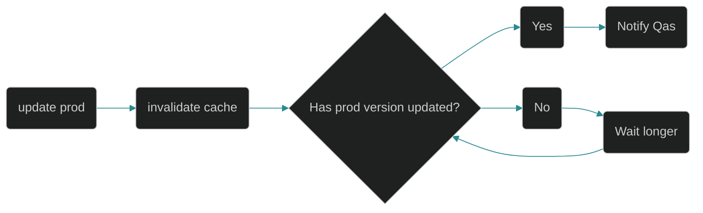
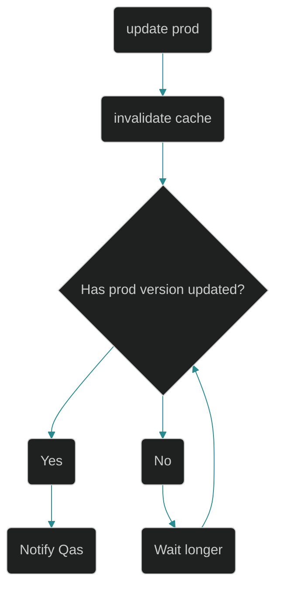

<InlineImage
	containerClassName="mx-0 lg:mx-0"
	imgDivClassName="aspect-w-12 aspect-h-7"
	src="https://res.cloudinary.com/dinypqsgl/image/upload/v1715140985/blog/15-scripkit/collab-scripting.webp"
	alt="An image of ai generated people using an anvil and blacksmiting scripts for my automation"
/>

Hey hey; I'm back again and today I wanna talk about
[Script Kit](https://www.scriptkit.com/); I heard about it from Kent (in
passing) whilst attending [Epic Conf](https://epicweb.dev/conf)! In short, it's
primary purpose is to help developers automate tedious parts of their workflows
with an easy to use scripting platform. All the scripts you write are in JS and
TS (see ya later bash) and by virtue of making JS + TS first class citizens, you
can do some real nifty things.

There are 4 reasons why I like `Script Kit` and I'll be elaborating on each. If
you're too busy or too lazy to read the rest of the article (both of which are
fine reasons to not read anything), here's the tldr:

1. It allows you to automate tedious tasks with its nifty scripting features.
2. It's super fun to learn (if you're into that kinda thing, which I am).
3. It lowers the barrier to entry for scripting to include people who mostly us
   JS + TS and not things like bash or python.
4. Your scripts can run in a GUI or the CLI; great because you can't really drag
   and drop things in the CLI.

## Automate all the things

I once heard of a developer that would automate any task that he had to repeat
more than twice in a given week (or something to that effect). This man wrote a
script that would send out a text to his wife at 5:00 pm if he has not logged
off his work computer, giving her some randomized excuse for why he was running
late. I mean, I'm not saying I would do that but I'm not saying that I wouldn't
either -- although my script would give her the honest reason (work has been
chaotic and chances are something is most likely on fire 😆). While I don't
think I'd ever go as far as automating something if I had to do it more than
twice in a week, there is something to be said about the spirit of automating
tedious tasks that have to get done but aren't necessarily a good use of our
time!

In my case, whenever we do a release to production at work, I, like a lot of
folks, need to wait for our cache to invalidate before I can tell our QA
Engineers to kick off regression tests. Ideally, there would be some sort of
webhook that gets fired once the cache has been invalidated in our CI process
but, like a lot of companies, we've got bigger fish to fry than improving our CI
process and improving our developer experience. Prior to `Script Kit`, I would
wait around for 10ish minutes and check the version manually because within that
10ish minutes, there was a pretty good chance (not an absolute chance) that the
version would update. Essentially the flow looked like the below:

<div className='hidden md:block my-8'>

</div>

<div className='block md:hidden my-8'>

</div>

However, it was equally likely that the version could update within one minute
or within ten minutes so the ten minutes I listed above is the upper bound for
the longest time estimate. My coworker Daniele didn't like that we had to
manually check and you can imagine why: one can't enter flow state because
they've got the looming release on their mind and if they do enter flow state,
they might accidentally forget to notify folks that the production release is
ready for testing -- I'm guilty of the latter where the cache invalidates within
5 minutes but because I was busy writing code for another feature, I ended up
not telling folks until 30ish minutes later 😅.

Daniele wrote up a quick node script (him and Copilot I presume) that would ping
the prod server for ten minutes and upon either timeout or successful version
change, he'd get a notification on his phone (and apple watch) about the status
of the change. I personally didn't use his script -- not because it wasn't good
but because it seemed like a hassle to set up another alias on my bash profile
to execute some random node script. I'm lazy, I know 🙈. However, after
[Epic Conf](https://epicweb.dev/conf), I decided to give `Script Kit` a try and
tweaked his version checker script for `Script Kit` -- which was pretty easy
since his code was already written in JS. Not only did his script work, but I
was also able to improve on it by removing some verbosity around fetch calls as
`Script Kit` has nice little helpers like `get` and `open` available in the
runtime! You can see the example here:

```js:title=example-version-checker.js
// Name: Version pinger
// Author: Taran Bains

import "@johnlindquist/kit";

const url = await arg("Set URL:", []);

// I use ntfy to subscribe to messages
const topic = await arg("Set ntfy topic:", [""]);

async function sendNotify(msg: string) {
  try {
    await $`curl -d "${msg}" ntfy.sh/${topic}`;
  } catch (error) {
    console.error("Notification Error:", error.message);
  }
}

let firstVersion = (await get(url))?.data?.version;
let lastVersion = firstVersion;

const startTime = Date.now();
const timeLimit = 10 * 60 * 1000;

async function checkVersionChange() {
  try {
    const response = await get(url);
    const newVersion = response.data.version;
    if (newVersion !== lastVersion) {
      await sendNotify(`Version changed from ${lastVersion} to ${newVersion}`);
      lastVersion = newVersion;
      return false; // Stop checking after version change
    }
    return true; // Continue checking
  } catch (error) {
    console.error("Error fetching version:", error.message);
  }
}

async function startPinging() {
  const interval = setInterval(async () => {
    if (Date.now() - startTime > timeLimit) {
      clearInterval(interval);
      await sendNotify("Timed out checking version");
    } else {
      const shouldContinue = await checkVersionChange();
      // log the date in a human readable way
      let prettyDate = new Date().toLocaleString();
      console.log(
        `${prettyDate} -  Pinging ${url}. Old Version: ${firstVersion}`,
      );
      if (!shouldContinue) {
        clearInterval(interval);
        notify("Finished running script");
      }
    }
  }, 3000);
}
startPinging();
```

I'll be honest, after creating that first script, I got a little trigger happy
and automated a few more tasks 😳. I automated opening up the URL for my
deployed feature branches, I automated querying my open pull requests by Jira
ticket number, and I automated opening the current running CI pipeline for
specific feature branches -- all these things were easy enough to do manually
but they'd require me clicking around the browser a handful of times, which
while not bad in and of itself, was definitely annoying.

## Super fun

If it isn't abundantly clear to you by now, I absolutely love to learn (I also
curse like a sailor). So when I say it was fun to learn about scripting and
`Script Kit`, you shouldn't be surprised.

What made it fun, at least for me, was that I had found a _new_ way to improve
upon my life! I'm constantly chasing progress and improvement -- not because I'm
not content, I am, but because getting better is incredibly invigorating. That
feeling of being level 1 and getting to level 5, oof, it just hits different.
Also, as y'all know, I am a `Sikh` and the world `Sikh` in Punjabi literally
translates into `to learn`, so there's a certain fulfillment I feel when I learn
something new, irrespective of whether or not it's related to faith.

<BlockQuote author="Guru Nanak Dev Ji">
	ਵਿਦਿਆ ਵੀਚਾਰੀ ਤਾਂ ਪਰਉਪਕਾਰੀ ॥ Consider and contemplate upon knowledge, and you
	will become a benefactor to others.
</BlockQuote>

Plus, and I've said this before, variety is the spice of life! Try something
new! Whether that's scripting or trying to do a backflip, don't allow yourself
to fall into a rut -- invoke that beginners mindset and what's an easier way
than, you know, trying something new 😃!

## Scripting for all

Scripting felt like this magical far away skill reserved for linux system admins
who had a profound and intimate knowledge of `bash` -- not a full stack (but
mostly frontend) developer such as myself. It legitimately felt like it was
going to be _way_ too much effort to get started learning how to script
_properly_ because it required me to learn bash and other tools. And yes, I
know, I write `TypeScript` for a living (script is in the name) and yes, I know,
tools like [google/zx](https://github.com/google/zx) exist to help make
scripting easier, but still, it didn't feel like the friction I was going to
face when getting started was going to be worth the eventual payoff. Unlike the
traditional meme developer, I don't like to spend 6 hours of my life automating
a task that only takes me a minute to do.

Another thing about scripting and this is unrelated to anything really to do
with the tooling, but I didn't feel `empowered` to easily share my
scripts/automations with my coworkers. As I mentioned above, the whole reason I
didn't want to use my coworkers node script is because I was _lazy_ and not in
the right way (but I guess maybe in the right way, because if I wasn't this kind
of lazy, then Scriptkit wouldn't be a thing). But another reason is that I
didn't want to have to deal with the whole "well it works on my machine and my
version of node" issue if I ever shared a script with a colleague. The whole
point of scripting was to help make my life easier -- not make it harder by
having me answer and provide help to my colleagues when my tiny script to ping
our prod server failed to work for them 😥.

Look how easy and small the script to empty your trash is! After the set up of
`Script Kit`, it's as easy as running `empty-trash` from the terminal to empty
my Mac's trash (or Windows Recycle Bin)!

```js:title=empty-trash.js
// Name: Empty Trash
// Author: Ricardo Gonçalves Bassete

import "@johnlindquist/kit"
import emptyTrash from 'empty-trash'

await emptyTrash()
```

## A GUI + Terminal interface

Alright, y'all know it, I know it, my family even knows it -- I love the
terminal! I picked up `neovim` 2 years ago and haven't looked back! However,
that isn't to say that I don't use GUIs -- GUIs definitely have their place in
my toolbelt. GUIs are great... and that's why it's awesome that `Script Kit`
includes a GUI and a CLI for us to use.

<InlineImage
	lazyLoadImage
	imgDivClassName="aspect-w-12 aspect-h-8"
	containerClassName="mx-0 lg:mx-0"
	src="https://res.cloudinary.com/dinypqsgl/image/upload/v1715192154/blog/15-scripkit/gui-example.png"
	alt="A screenshot of my terminal"
/>

One script I use pretty often is
[cloudinary upload](https://www.scriptkit.com/kentcdodds/cloudinary-upload). I
already tried using it from the terminal and it doesn't work 😅 since we don't
have a drag and drop interface for the terminal (at least not one that I'm aware
of). That's why it's super great to have the GUI -- if there are certain
elements that require a GUI, we get that.

However, the
[chrome-bookmark](https://www.scriptkit.com/tearingItUp786/navigate-chrome-bookmarks-with-folder-support)
script that I wrote can run in the terminal (it has no dependency on GUI
elements) so I lovingly use it in the terminal. Check it out when you get a
chance! Isn't that so **cool**; You get the best of both worlds!

## Closing thoughts

Okay so, automation is great. [Script Kit](https://www.scriptkit.com/) is great.
However, if you're not careful and don't understand the inherent risks of
scripting, hold off and ask for help! We don't want to be willy nilly installing
packages to our machines and executing the code.

Check it out and publish your scripts to the community; if you have any cool
scripts that you've written, send them my way!
