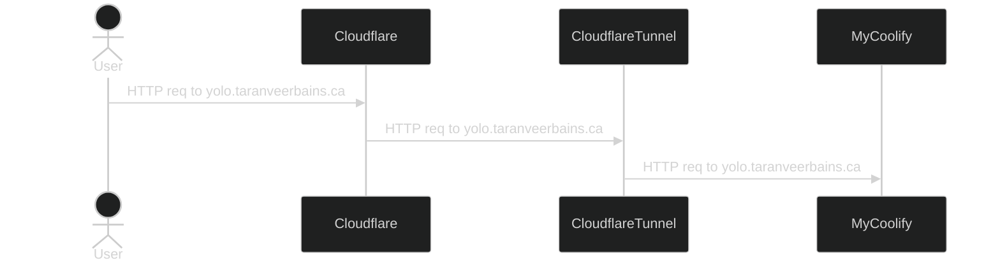

In another life, I used to work as an IT tech support worker/Business Analyst
(weird right) at the Beedie School of Business. Shout out to
[Mike Church](https://www.linkedin.com/in/mikejchurch/) for giving me the
opportunity to work there and for nurturing my passion for technology, you're a
real one 🙏🏽.

Whilst working at Beedie, I was exposed to lots of different things and one of
these things was home networking and the concept of a homelab. For those of you
who don't know what a homelab is, it's like a mini data center that you set up
at home. It's a collection of computers, servers, or other tech gear that lets
you experiment, learn, and run different software or services without relying on
external providers like Google or Amazon.

When I asked my colleagues to explain the benefits of a homelab, I was told that
it's like having your own personal playground for apps you'd like to try out.
For example, maybe you're wanting to try out your own media streaming app, like
[Plex](https://www.plex.tv/)), and paying to host that, simply for
experimentation kinda feels like a waste of money, since you don't even know if
you're gonna end up using it regularly. Moreover, having a homelab enables you
to own your own data versus hosting stuff on the cloud which is really just
other people's servers lol 😅. For instance, there's a self-hosted version of
Google Drive called [NextCloud](https://nextcloud.com/) that you can use to do
your own file management. There's tons of self-hosted versions of apps out
there; this
[awesome list](https://github.com/awesome-selfhosted/awesome-selfhosted) has so
many!

A few years ago, I actually had a homelab set up for streaming media content
from Plex, but it fell to the wayside after I moved. After the move, I was never
really that motivated to boot my server back up since I had nothing I really
wanted to use it for -- it sat there collecting dust. That all changed after I
saw this short by Melkey!

https://www.youtube.com/shorts/npDPhIoS1Z8

A self-hosted Heroku and Vercel? Yes, please! What's not to love? I've been
using [fly.io](https://fly.io) for the past year to host my apps, and I
absolutely love it. However, the ability to deploy one-off apps for tinkering or
work presentations for free is a dream come true.

Now don't get me wrong, [Fly](https://fly.io) (and vercel probalby) has an
incredibly generous free tier, doesn't force you to pay bills that are less that
$5 for the month, and mostly awesomely, Fly has
[accident forgiveness](https://fly.io/blog/accident-forgiveness/) for when you
stupidly rack up a $5000 bill because of a misconfiguration. Fun fact, I racked
up a $3000 AWS bill when I worked at a real-estate marketing company 😅 but
luckily AWS forgave us after my boss explained how the intern messed up when
playing around with hosting wordpress sites.

## My goal

Alright, hopefully you're still with me after that little word vomit above --
which I, unironically, call 'context setting' 😆. Now, let's dive into my goals
for my 2024 homelab.

- Self hosting my media (Plex, etc)
- Self hosting some web apps (like my
  [go and htmx demo](https://gotodo.taranveerbains.ca/signin), and my
  [nx demo](https://nxthing.taranveerbains.ca/signin))
- Securely exposing applications on my homelab to the public internet
- Having fun (duh) and learning!

## Server setup

### Hardware

I'm running [TrueNAS Scale](https://www.truenas.com/truenas-scale/) on an AMD
A6-5200 APU with Radeon(TM) HD Graphics (circa 2013) with 9GB of RAM. This setup
is quite dated by today's standards, but it's all I got so we gotta make due. My
machine has 1TB of storage space (two hard drives running RAIDZ1), and the OS is
running on a 256GB portable SSD.

### Software

TrueNAS Scale is a great piece of software, and I'm really happy with it.
However, one thing that's a little bit annoying about Scale is that it's not
really easy to set up jails as opposed to TrueNAS Core, where it's super easy. A
jail is a lightweight virtualized envrionemnt that lets you run applications in
isolation from the main OS. It's similar to Docker but operates at the process
level rather than at the full system level.

Jails are great because they're pretty simple to setup, easier to maintain, and
easier to update. Docker needs to be provisioned in a VM which means we need to
specify a dedicated amount of CPU and RAM to give the machine, hurting the
overall system if we over provision said VM.

TrueNAS Scale ships with support for K8s and Docker, but I had a rough time
figuring out how I could utilize those tools to host a coolify instance.
Thankfully, there's a
[handy youtube video](https://www.youtube.com/watch?v=S0nTRvAHAP8) that shows
you how to set up jails with TrueNAS Scale.

After setting up my Coolify jail, I was able to install it on my NAS via the
install command: `curl -fsSL https://cdn.coollabs.io/coolify/install.sh | bash`.

<InlineImage
  lazyLoadImage
  imgDivClassName="aspect-w-[128] aspect-h-[71]"
  containerClassName="mx-0 lg:mx-0"
  src="https://res.cloudinary.com/dinypqsgl/image/upload/v1726420649/blog/16-self-hosting/raw-coolify.png"
  alt="My static IP setup for my NAS, docker, and coolify"
/>

After running through the Coolify installation process, I was able to access
Coolify from within my network by opening up my browser and going to the IP
address that it was assigned by my router. So this was great, I had my NAS up
and running coolify, but I couldn't access it from outside of my network.
`10.0.0.21:8000` was only accessible if you were on the same network as my NAS
😥 so if I was chilling at Starbucks, I couldn't access my coolify instance
(which is very important to me) 😅.

Moreover, every time I restarted my NAS, my NAS and coolify would be assigned
new IP addresses 😑.

### The internal networking setup

It's recommended to use a wired connection for your NAS, as these connections
tend to be more stable and less prone to inteference. Your typical wireless
connections can run into issues with other frequencies and devices -- my
microwave has more than once caused my devices connected via wifi some issues.

Another important step is setting up a static IP address for your NAS. This
ensures that when you reboot your server (which will happen from time to time),
it keeps the same IP address. By default, your home router has a built in DHCP
server and machines that connect to your network will be given an IP from your
router. DHCP is a protocol that allows your router to dynamically assign an IP
address to your machines as they pop up and connect to your network. This is
great most of the time, but it can cause issues in the case of a reboot (the
machine could get a new IP address).

For the case of our NAS, having a static IP address is important because we can
easily reconnect to our NAS without needing to manually adjust to a new IP
address and any other services/devices that connect to our network will be able
to connect to our NAS without issue.

This video does a pretty good job explaining how you can set up a static IP for
your standard consumer router. This
[video](https://www.youtube.com/watch?v=kGUhSOBP4HM) does a pretty good job
walking you through the setup!

My own home network is set up like this:

<InlineImage
  lazyLoadImage
  imgDivClassName="aspect-w-[128] aspect-h-[29]"
  containerClassName="mx-0 lg:mx-0"
  src="https://res.cloudinary.com/dinypqsgl/image/upload/v1726420002/blog/16-self-hosting/static-ips.png"
  alt="My static IP setup for my NAS, docker, and coolify"
/>

## Setting up Plex

With TrueNAS Scale up and running, the next step was to get Plex up and running.
Plex is crucial for my media streaming needs, so here's how I configured it...

Most things that are self-hosted run on docker or docker compose these days so
they are easy to port from machine to machine (the OCI spec is great eh) 🤯! If
you follow through with the video I mentioned above about setting up jails in
TrueNAS Scale, you'll see that one of the easiest ways to manage your docker
containers is to use [dockge](https://github.com/louislam/dockge).

Once I set up `dockge`, I was able to run my Plex instance in a docker
container. That was it. Plex was up and running in a few minutes. The hardest
thing about this process was setting up the data-pools correctly to mount Plex
data to the correct location on my TrueNAS.

<InlineImage
  lazyLoadImage
  imgDivClassName="aspect-w-13 aspect-h-8"
  containerClassName="mx-0 lg:mx-0"
  src="https://res.cloudinary.com/dinypqsgl/image/upload/v1726427323/blog/16-self-hosting/dockge.png"
  alt="a screenshot of my plex docker container"
/>

Self hosting my media with Plex ✅! Granted, we're not able to connect to the
server outside of our network... just yet, but let's talk about setting up
Coolify to host my web apps before we get to that.

## Hosting apps on Coolify

I'm not joking when I say that it's _super_ easy to host apps on Coolify. I was
able to host my
[go and htmx demo](https://github.com/tearingItUp786/go-lang-todo) and my
[nx demo](https://github.com/tearingItUp786/nx-example-old-code) on Coolify in a
matter of minutes. One of these is a `Go` server and the other is client side
React app.

There were some tweaks that I had to make to get my React app to work; the main
one being, I had to create a `Dockerfile`!

While `Coolify` will use [`Nixpack`](https://nixpacks.com/docs) to build your
app if there isn't a `Dockerfile` present, I found that it took way longer to
build than when I used my own `Dockerfile`. Here's a small example of how easy
it is to connect Coolify to a github project and deploy it to your instance!

So now, I was able to to go to `10.0.0.21:7860` and see my app running! But,
wait, you might say. How the heck were you able to get to
`yolo.taranveerbains.ca`? The image below shows you that I am indeed able to hit
`https://yolo.taranveerbains.ca` and see my app running! Let's get into exposing
my apps. This is SFW I swear 😆!

## Cloudflare tunnels to the rescue

If you're already using Cloudflare, you can use their Tunnels to expose your
apps to the public internet. My primary domain -- `taranveerbains.ca` -- is
using Cloudflare's nameservers and so I'm already a part of their network and
could benefit from their Tunnels.

With a Tunnel, we don't actually send any traffic to an external IP. A
lightweight daemon (`cloudflared`) is running on your server and creates
outbound connections to Cloudflare's network. This is awesome because it means
that our servers can serve traffic through Cloudflare without being vulnerable
to attacks that bypass Cloudflare's network.

Granted, this is locking me down to Cloudflare's network, but I'm not going to
worry about that for now since, like I said above, the whole purpose of my
homelab is to be able to run my own apps and services for the purposes of
experimentation and learning! So how exactly does this work? I'm glad you asked!

### HTTP Request Flow for yolo.taranveerbains.ca

Cloudflare has some great docs on their
[Tunnels](https://developers.cloudflare.com/cloudflare-one/connections/connect-networks/)
that explain how the underlying technology works. I've included the diagram
below that explains my understaning of the setup -- note that it only covers the
general gist of how the Tunnel works.

Okay so we've got a decent understanding of how the tunnels work, but how do we
actually use them with Coolify? Suprisingly, it's super easy and straightforward
🤯!

### Installing cloudflared on Coolify

Did you know that Coolify has some pretty great docs 🔥! They have a knowledge
base article on
[how to install cloudflare tunnels](https://coolify.io/docs/knowledge-base/cloudflare/tunnels)
that walks you through the steps to install `cloudflared` on Coolify.

<InlineImage
  lazyLoadImage
  imgDivClassName="aspect-w-13 aspect-h-9"
  containerClassName="mx-0 lg:mx-0"
  src="https://res.cloudinary.com/dinypqsgl/image/upload/v1726426241/blog/16-self-hosting/coolify-docs.png"
  alt="a screenshot of coolify's docs"
/>

For my server, I first attemped to do the `one domain -> one resource` setup but
ended up going with the `wildcard subdomain -> all resources` after I ran into
some issues. I ended up having to go the wildcard route for my setup because I
noticed that if I tried to install
[`services`](https://coolify.io/docs/services) like
[`uptime kuma`](https://github.com/louislam/uptime-kuma) with Coolify and didn't
specify a domain name, Coolify would error out with a message like:
`fqdn error: fqdn must be unqique`. After switching to the wildcard method, I
had to specify the domain for each service inside of my Coolify instance if I
wanted to expose it to the public interent (which you have to do anyways from
Cloudflare if you do the one domain -> one resource setup).

## Closing Thoughts

In closing, setting up a homelab has been an incredibly rewarding experience.
Not only has it allowed me to breathe new life into old hardware, but it has
also given me a playground for experimenting with self-hosted solutions and
learning more about networking, containers, and cloud alternatives. Whether
you're looking to secure your own media, run personal web apps, or simply tinker
and learn, a homelab offers a unique hands-on opportunity. Plus, the sense of
ownership over your own data is freaking sick.

If you're thinking about building your own homelab, don't be discouraged by
older hardware or potential technical challenges. There's a wealth of resources
and a community of enthusiasts to help along the way. Dive in, experiment, and
enjoy the process—you never know what you might create or discover!

If you have any questions or comments, feel free to reach out to me on
[Twitter](https://twitter.com/tearingItUp786) or
[LinkedIn](https://www.linkedin.com/in/bainstaranveer/).
