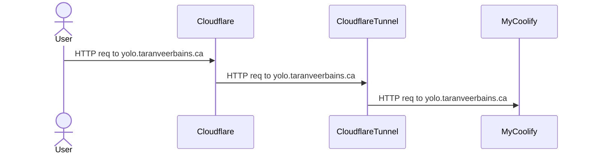

# Mermaid Light Mode Visibility Fix

> **For Claude:** REQUIRED SUB-SKILL: Use superpowers:executing-plans to
> implement this plan task-by-task.

**Goal:** Fix mermaid diagrams being illegible in light mode by switching to the
`neutral` theme globally via `rehype-mermaid`'s `mermaidConfig` option and
removing per-diagram `'theme': 'dark'` overrides.

**Architecture:** `rehype-mermaid` (v3, `strategy: 'img-svg'`) renders diagrams
server-side via Playwright and embeds them as `` tags with inline SVG. The
root cause is that `'theme': 'dark'` is baked into the SVGs at compile time,
making them illegible on a white/light background. The fix is to pass
`mermaidConfig: { theme: 'neutral' }` globally to `rehypeMermaid`, then remove
all per-diagram `'theme': 'dark'` init overrides. The `neutral` mermaid theme
uses dark text/lines on a transparent background, legible in light mode. The
existing dead CSS hacks in `blog.css` are cleaned up as a bonus.

**Tech Stack:** `rehype-mermaid@^3.0.0`, MDX, React Router (framework mode),
Tailwind CSS

---

### Task 1: Add `mermaidConfig` to `rehypeMermaid` in the MDX processing pipeline

**Files:**

- Modify: `app/utils/mdx.server.ts:154`

**Step 1: Open the file and locate the `rehypeMermaid` plugin registration**

The line to change is at `app/utils/mdx.server.ts:154`:

```ts
[rehypeMermaid, { strategy: 'img-svg' }],
```

**Step 2: Add `mermaidConfig` with `theme: 'neutral'`**

Change it to:

```ts
[rehypeMermaid, { strategy: 'img-svg', mermaidConfig: { theme: 'neutral' } }],
```

**Step 3: Verify no type errors**

Run:

```bash
pnpm typecheck
```

Expected: no errors related to this change. (`mermaidConfig` is a valid option
per the `rehype-mermaid` API.)

**Step 4: Commit**

```bash
git add app/utils/mdx.server.ts
git commit -m "fix: set mermaid neutral theme globally via mermaidConfig"
```

---

### Task 2: Remove dark theme override from the self-hosting post

**Files:**

- Modify: `content/blog/16-self-hosting/index.mdx:318-334`

**Step 1: Locate the mermaid block**

The block at lines 318–334 currently reads:

````
```mermaid
%%{
  init: {
    'theme': 'dark'
  }
}%%
sequenceDiagram
    Actor User
    ...
````

```

**Step 2: Remove the `%%{ init }%%` block entirely**

The result should be:
```



````

**Step 3: Commit**

```bash
git add content/blog/16-self-hosting/index.mdx
git commit -m "fix: remove dark theme override from self-hosting mermaid diagram"
````

---

### Task 3: Remove dark theme override from the scriptkit post (keep `themeVariables`)

**Files:**

- Modify: `content/blog/15-scriptkit/index.mdx:61-91` and
  `content/blog/15-scriptkit/index.mdx:94-126`

There are two mermaid blocks (one for desktop `graph LR`, one for mobile
`graph TD`). Both have `'theme': 'dark'` as the first key inside `init`. Remove
**only** the `'theme': 'dark',` line from each block, leaving all
`themeVariables` intact.

**Step 1: Update the desktop diagram block (lines ~62-75)**

Before:

```
%%{
  init: {
    'theme': 'dark',
    'themeVariables': {
      'fontSize": '16px',
      'primaryColor': '#b01d8b',
      'primaryTextColor': '#f3f3f7',
      'primaryBorderColor': '#D3BCC0',
      'lineColor': '#2a8a90',
      'secondaryColor': '#507DBC',
      'tertiaryColor': '#F4F4F2'
    }
  }
}%%
```

After (remove the `'theme': 'dark',` line):

```
%%{
  init: {
    'themeVariables': {
      'fontSize": '16px',
      'primaryColor': '#b01d8b',
      'primaryTextColor': '#f3f3f7',
      'primaryBorderColor': '#D3BCC0',
      'lineColor': '#2a8a90',
      'secondaryColor': '#507DBC',
      'tertiaryColor': '#F4F4F2'
    }
  }
}%%
```

**Step 2: Apply the same change to the mobile diagram block (lines ~96-109)**

Same edit: remove the `'theme': 'dark',` line, keep `themeVariables`.

**Step 3: Commit**

```bash
git add content/blog/15-scriptkit/index.mdx
git commit -m "fix: remove dark theme override from scriptkit mermaid diagrams, keep themeVariables"
```

---

### Task 4: Clean up dead CSS hacks in `blog.css`

**Files:**

- Modify: `app/styles/blog.css`

The existing rules in `blog.css` target SVG elements inside mermaid diagrams
(`.messageText`, `.messageLine0`, `.actor-man`, `#arrowhead path`). With
`strategy: 'img-svg'`, the SVG is embedded as a data URI inside an `` tag —
CSS **cannot reach inside `` content**. These rules have been dead since
the switch to `img-svg` strategy. Remove them.

**Step 1: Clear the contents of `app/styles/blog.css`**

The entire file is dead CSS. You can delete all 29 lines. Leave an empty file or
remove it entirely.

> **Note:** Check if `blog.css` is imported anywhere before deleting the file
> itself.

**Step 1a: Find the import**

Search for `blog.css` in the codebase:

```bash
grep -r "blog.css" app/
```

**Step 1b: If `blog.css` is imported, clear its contents (keep the file)**

If it's imported somewhere, just empty the file (remove all rules). If it's not
imported anywhere, the file is unreferenced and can be deleted.

**Step 2: Commit**

```bash
git add app/styles/blog.css
git commit -m "chore: remove dead mermaid CSS hacks from blog.css (img-svg strategy makes them unreachable)"
```

---

### Task 5: Verify the fix builds without errors

**Step 1: Run typecheck and lint**

```bash
pnpm typecheck && pnpm lint
```

Expected: no errors.

**Step 2: Run the test suite**

```bash
pnpm test
```

Expected: all tests pass.

**Step 3: (Optional) Do a local build to confirm mermaid renders correctly**

```bash
pnpm build
```

Then start the server and navigate to `/blog/self-hosting` and `/blog/scriptkit`
and `/blog/making-a-tui-with-go`. Verify diagrams are legible in both light and
dark mode.

---

### Notes

- `content/blog/13-making-a-tui-with-go/index.mdx` uses `'theme': 'base'` (not
  `'dark'`) with explicit `themeVariables`. The `base` theme also uses dark text
  on a light background, so it is already legible in light mode. **No change
  needed for this file.**
- If after building you find the `neutral` theme's default colors conflict with
  your site palette, you can add additional keys to `mermaidConfig` (e.g.,
  `fontFamily`) or override per-diagram with
  `%%{ init: { 'themeVariables': { ... } } }%%` without specifying a theme.
